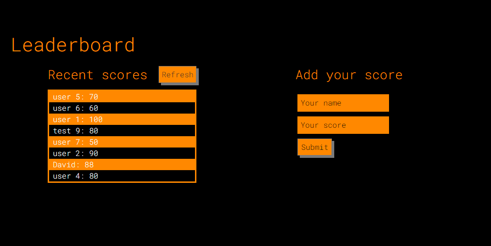

# Leaderboard

> The leaderboard website displays scores submitted by different players. It also allows you to submit your score. All data is preserved thanks to the external Leaderboard API service.




## Built With

- HTML
- CSS
- JavaScript
- Webpack


## Getting Started

To get a local copy up and running follow these simple example steps.

### Prerequisites

- Node.js
- npm

### Setup

- clone: run ```git clone https://github.com/petumazo/leaderboard.git```.
- Move to cloned folder: run ```git cd leaderboard```.
- 
### Install

- Install the dependencies in the local node_modules folder: run ```npm install```.
- Build your app: run ```npm run build```.
- Deploy local server: run ```npm start build```.


## Authors

👤 **David Alvarez Mazzo**

- GitHub: [@petumazo](https://github.com/petumazo)
- Twitter: [@petudeveloper](https://twitter.com/petudeveloper)
- LinkedIn: [David Alvarez Mazzo](https://www.linkedin.com/in/davidalvarezmazzo/)

## 🤝 Contributing

Contributions, issues, and feature requests are welcome!

Feel free to check the [issues page](../../issues/).

## Show your support

Give a ⭐️ if you like this project!

## Acknowledgments

- Hat tip to anyone whose code was used
- Inspiration
- etc

## 📝 License

This project is [MIT](./MIT.md) licensed.

